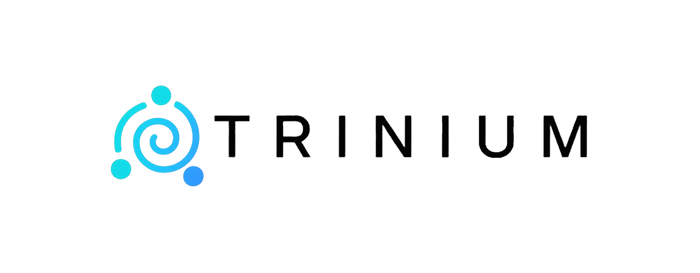

# TRINIUM — Tecnología con corazón 💙



Sitio web corporativo de **TRINIUM**, empresa mexicana de tecnología especializada en desarrollo de software a la medida, automatización de procesos e infraestructura IT.

## 🌐 Demo

🔗 [Ver sitio en vivo](https://lovable.dev/projects/728107fb-5b26-46c5-a2d0-07e66975aea8)

## ✨ Características

- **Landing page moderna** con animaciones scroll-reveal y diseño responsivo
- **Modo claro/oscuro** con cambio dinámico de assets
- **Portafolio interactivo** con carruseles de capturas reales de proyectos (Inventory Cloud, BUNKER, MARIALE, MERIDIA)
- **Sección de servicios** con modales informativos al hacer clic
- **Infraestructura IT** — subsección técnica destacando +15 años de experiencia en servidores, redes y seguridad
- **CTA dual** — contacto rápido vía WhatsApp + formulario con mailto
- **Easter egg** oculto en el footer 🎯
- **SEO optimizado** con meta tags, JSON-LD y HTML semántico

## 🛠️ Stack tecnológico

| Tecnología | Uso |
|---|---|
| **React 18** | UI components |
| **TypeScript** | Tipado estático |
| **Vite 5** | Build tool y dev server |
| **Tailwind CSS v3** | Estilos utilitarios |
| **shadcn/ui** | Componentes UI (Radix UI) |
| **next-themes** | Modo claro/oscuro |
| **Lucide React** | Iconografía |
| **React Router** | Navegación SPA |

## 🚀 Instalación

```bash
# Clonar el repositorio
git clone <YOUR_GIT_URL>

# Entrar al directorio
cd <YOUR_PROJECT_NAME>

# Instalar dependencias
npm install

# Iniciar servidor de desarrollo
npm run dev
```

## 📁 Estructura del proyecto

```
src/
├── assets/          # Logos, capturas de pantalla de proyectos
├── components/      # Componentes de la landing
│   ├── ui/          # Componentes shadcn/ui
│   ├── Header.tsx   # Navegación con logo dinámico
│   ├── Hero.tsx     # Sección principal
│   ├── WhatWeDo.tsx # Servicios + Infraestructura IT
│   ├── HowWeWork.tsx
│   ├── RealCases.tsx # Portafolio con carruseles
│   ├── WhyTrinium.tsx
│   ├── Philosophy.tsx
│   ├── ContactModal.tsx # WhatsApp + Formulario
│   └── Footer.tsx
├── hooks/           # Custom hooks (scroll reveal, mobile)
├── pages/           # Páginas (Index, NotFound)
└── index.css        # Design system y tokens CSS
```

## 🎨 Servicios destacados

### Desarrollo de Software
- Sistemas web y móviles a la medida
- Automatización de procesos empresariales
- Dashboards y reportes

### Infraestructura IT (+15 años)
- **Servidores**: Windows/Linux, RAID, ILO/iDRAC, IIS, Nginx
- **Redes**: Mikrotik, WiFi Mesh, VPNs Endian, enlaces de microondas
- **Seguridad**: Firewalls, filtros de contenido, segmentación de red

## 📄 Licencia

© 2025 TRINIUM. Todos los derechos reservados.
